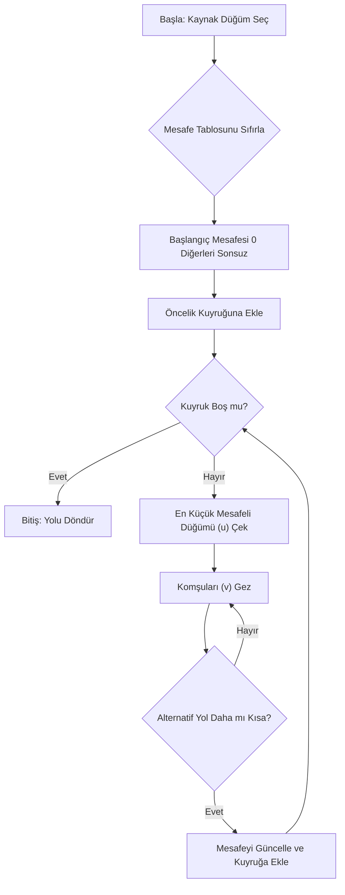
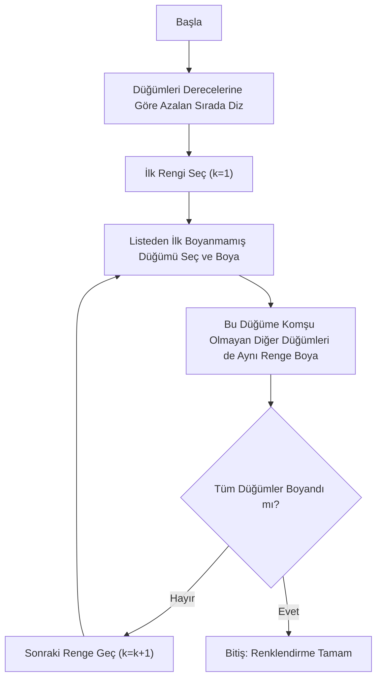
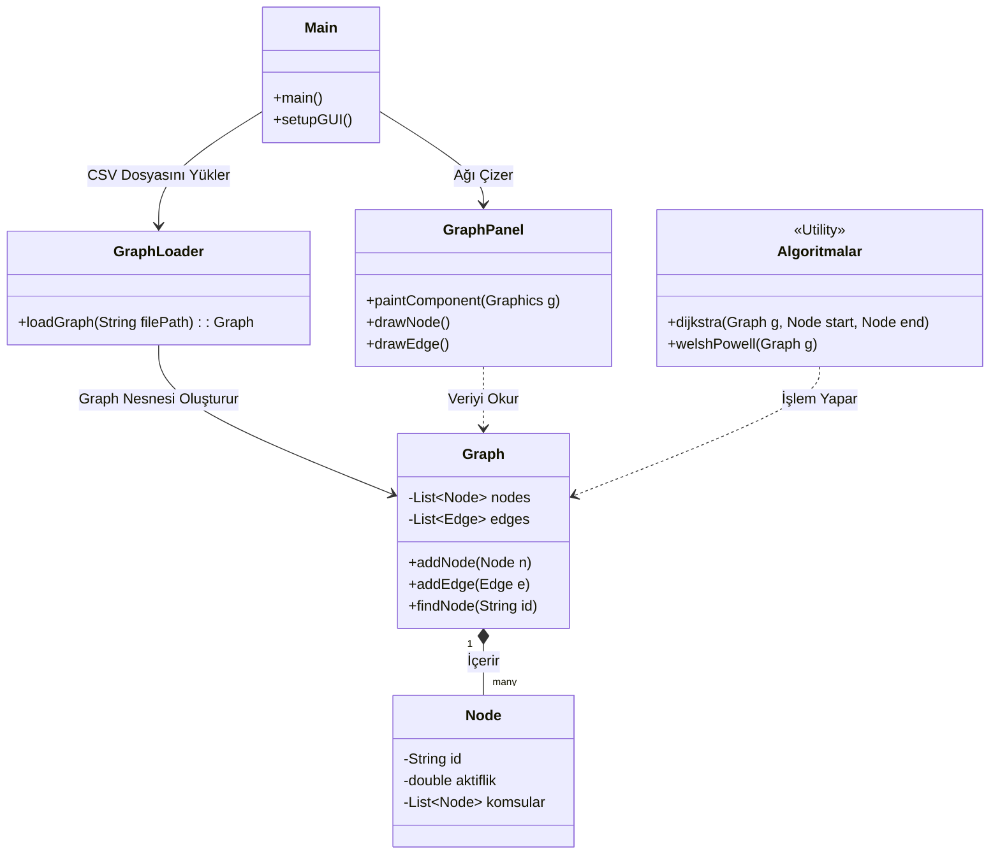
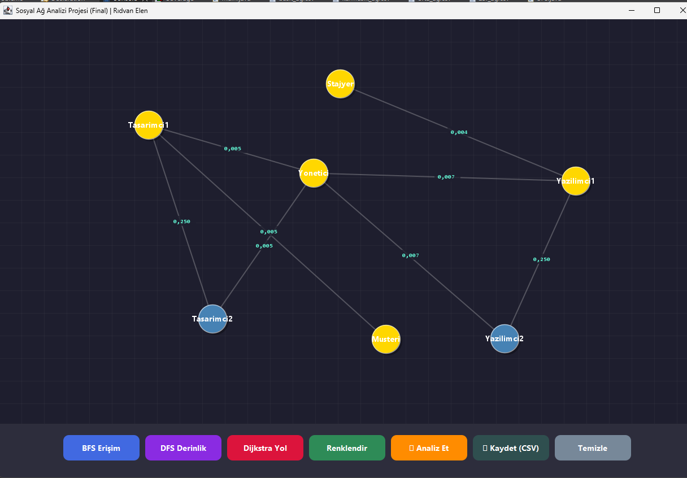
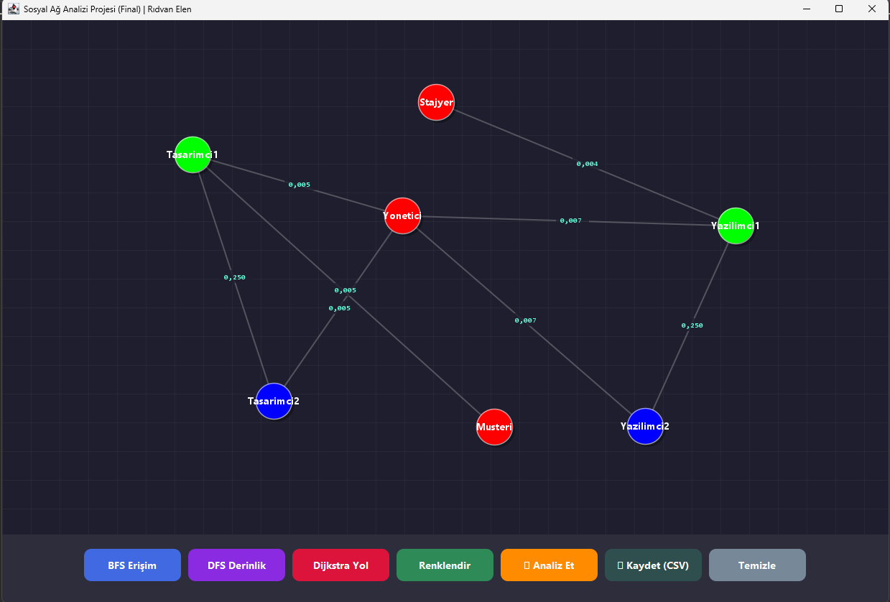
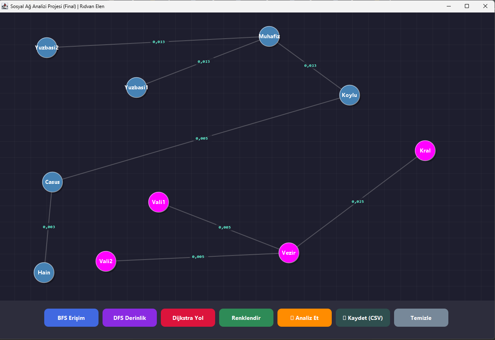

# Sosyal Ağ Analizi ve Görselleştirme Projesi

## 1. Proje Künyesi
- **Proje Adı:** Sosyal Ağ Analizi ve Görselleştirme (Social Network Analysis Tool)
- **Ders:** Yazılım Laboratuvarı 2
- **Ekip Üyeleri:** Rıdvan Elen - Muhammed Enes Omar
- **Tarih:** Ocak 2026
- **Dönem:** 2025-2026 Güz Dönemi

## 2. Giriş ve Problemin Tanımı

### 2.1. Problemin Tanımı
Günümüzde sosyal medya, iletişim altyapıları ve organizasyonel şemalar gibi sistemlerde veriler, kişiler (düğümler) ve aralarındaki ilişkiler (kenarlar) şeklinde tutulmaktadır. Ancak bu veriler ham haliyle (`.csv`, `.json` vb.) insanlar için anlaşılması güç, karmaşık listelerden ibarettir. Bu projenin temel problemi, metin tabanlı bu karmaşık ilişki ağlarını, insan algısına uygun grafiksel bir yapıya dönüştürmek ve bu yapı üzerinde matematiksel analizler yapabilmektir.

### 2.2. Amaç
Bu projenin temel amaçları şunlardır:
- Dinamik olarak yüklenen veri setlerini **Çizge Teorisi (Graph Theory)** prensiplerine göre modellemek.
- Kullanıcı dostu bir arayüz (GUI) ile düğümleri ve bağlantıları görselleştirmek.
- Ağ üzerindeki **en kısa yolu (Shortest Path)**, **merkeziliği (Centrality)** ve **gruplaşmaları (Clustering)** algoritmik olarak tespit etmektir.

## 3. Algoritmalar ve Analizler

Bu bölümde projede kullanılan temel algoritmaların çalışma mantığı, akış diyagramları, karmaşıklık analizleri ve literatür bilgileri sunulmuştur.

### 3.1. Dijkstra En Kısa Yol Algoritması
- **Literatür:** 1959 yılında Edsger W. Dijkstra tarafından geliştirilmiştir. Negatif ağırlıklı kenarların olmadığı graflarda en popüler yol bulma algoritmasıdır.
- **Çalışma Mantığı:** Başlangıç düğümünden diğer tüm düğümlere olan mesafeyi sonsuz, kendisine olan mesafeyi 0 kabul eder. Her adımda ziyaret edilmemiş en yakın düğümü seçer ve komşularının mesafelerini günceller.
- **Karmaşıklık Analizi:** Öncelik kuyruğu (Priority Queue) kullanıldığında $O(E + V \log V)$ karmaşıklığına sahiptir.

### 3.2. Welsh-Powell (Graph Coloring) Algoritması
- **Literatür:** Welsh ve Powell tarafından 1967 yılında, graf renklendirme problemleri için geliştirilmiş bir "Greedy" (Açgözlü) algoritmadır.
- **Çalışma Mantığı:** Düğümleri derecelerine (bağlantı sayılarına) göre çoktan aza sıralar. İlk renkle boyayabileceği en yüksek dereceli düğümü boyar, ardından ona komşu olmayanları da aynı renge boyar. Sonraki renge geçer.
- **Karmaşıklık Analizi:** Sıralama işlemi nedeniyle $O(V \log V + E)$ karmaşıklığındadır.

### 3.3. BFS (Breadth-First Search)
- **Literatür:** Edward F. Moore tarafından 1959'da labirentlerde en kısa yolu bulmak için formüle edilmiştir.
- **Çalışma Mantığı:** Başlangıç düğümünden başlar ve önce tüm doğrudan komşularını (1. seviye), sonra komşularının komşularını (2. seviye) ziyaret eder.
- **Karmaşıklık Analizi:** $O(V + E)$

## 4. Sınıf Yapısı ve Modüller

Proje MVC (Model-View-Controller) mimarisine benzer modüler bir yapıda geliştirilmiştir. Aşağıdaki Mermaid sınıf diyagramı sistemin mimarisini özetlemektedir.

## 5. Uygulama Açıklamaları, Testler ve Sonuçlar

### 5.1. Test Senaryoları

| Veri Seti | Dosya Adı | Yapı Tipi | Beklenen Sonuç | Gerçekleşen |
|----------|----------|----------|---------------|-------------|
| Basit | basit_ag.csv | Yıldız (Star) | Merkez düğümün en yüksek skora sahip olması | ✅ Başarılı |
| Orta | orta_ag.csv | Köprü | İki grubun farklı renklere boyanması | ✅ Başarılı |
| Zor | zor_ag.csv | Hiyerarşik | En kısa yolun ara düğümler üzerinden geçmesi | ✅ Başarılı |
| Karmaşık | karmasik_ag.csv | Rastgele | Büyük ağlarda performans ve görsellik testi | ✅ Başarılı |

### 5.2. Ekran Görüntüleri

Projede gerçekleştirilen analiz ve görselleştirme adımlarına ait ekran görüntüleri aşağıdadır:

**1. Popülerlik Analizi (Top 5)**
"Analiz Et" butonu ile ağ üzerindeki düğüm dereceleri hesaplanarak, en popüler (merkezi) 5 kullanıcının tespit edildiği ve listelendiği ekran:

**2. Dijkstra En Kısa Yol Tespiti**
Seçilen iki düğüm (Kişi) arasındaki en kısa ve optimum yolun görselleştirilmesi:

**3. Graph Coloring (Renklendirme)**
Welsh-Powell algoritması ile komşu düğümlerin farklı renklere boyanarak ayrıştırılması:

**4. BFS (Erişim) Analizi**
Sığ Öncelikli Arama (BFS) kullanılarak, başlangıç düğümünden itibaren dalga dalga yayılımın gösterimi:

**5. DFS (Derinlik) Analizi**
Derin Öncelikli Arama (DFS) ile ağın uç noktalarına doğru yapılan tarama işlemi:

## 6. Sonuç ve Tartışma

### 6.1. Başarılar
Proje, dinamik dosya okuma özelliği sayesinde kaynak kod değiştirilmeden farklı ağları analiz edebilir hale getirilmiştir. Java Swing ile özel bir çizim motoru yazılarak harici kütüphane (JGraphT vb.) bağımlılığı olmadan grafiksel gösterim sağlanmıştır. "Canlı" etkileşim ile kullanıcı sağ tık menüsünü kullanarak çalışma zamanında (runtime) yeni düğüm ve bağlantı ekleyebilmektedir.

### 6.2. Sınırlılıklar
Çok büyük veri setlerinde (10.000+ düğüm) Swing arayüzünün çizim performansı düşebilmektedir. Algoritmalar şu an için ağırlıksız veya pozitif ağırlıklı graflar için optimize edilmiştir.

### 6.3. Olası Geliştirmeler
Verilerin CSV yerine bir ilişkisel veritabanında (PostgreSQL) tutulması. Arayüzün Spring Boot ve React kullanılarak web tabanlı hale getirilmesi. "Force-Directed Layout" algoritması eklenerek düğümlerin ekranda otomatik olarak en uygun yerlere yayılmasının sağlanması.
